# Building my DevOps Portfolio 🚀

## Projects 10-11: Kubernetes Set up for production / Java app deployment on kubernetes cluster

One of the benefits of working at EY is Udemy for Business. I enrolled in the DevOps Projects | 20 Real-Time DevOps Projects course to enhance my DevOps portfolio and I’m sharing this process for educational purposes.

### Scenario:
- ✅Multi tier web application stack
- ✅Containerized
- ✅Test it
- ✅Want to host for production

### Requirement:
- ✅High availability
- ✅Fault tolerance
- ✅Easy scalable
- ✅Platform independent
- ✅Portable and flexible

### Container Orchestration Tool
- 🛠️Kubernetes

### Technologies
- Java stack (Vprofile, application services)
- Kubernetes cluster

### Steps.
- ⏭️Setup  Kubernetes Cluster (via kops)
- ⏭️Create EBS volume for DB Pod
- ⏭️Kube secret for passwords
- ⏭️DB deploy definition
- ⏭️DB Service definition
- ⏭️Kubernetes definition files for: Deployment, services, replicas and volume.(memcached, rabbitmq, tomcat)
- ⏭️ Test Kubernetes Cluster (deployment)

Udemy Course: https://www.udemy.com/course/devopsprojects/

### Upcoming Projects:
- 🚀Terraform for Cloud State 💜
- 🚀GitOps project

## JAVA APPLICATION DEPLOYMENT TO KUBERNETES CLUSTER

- AWS Kubernetes Diagram
  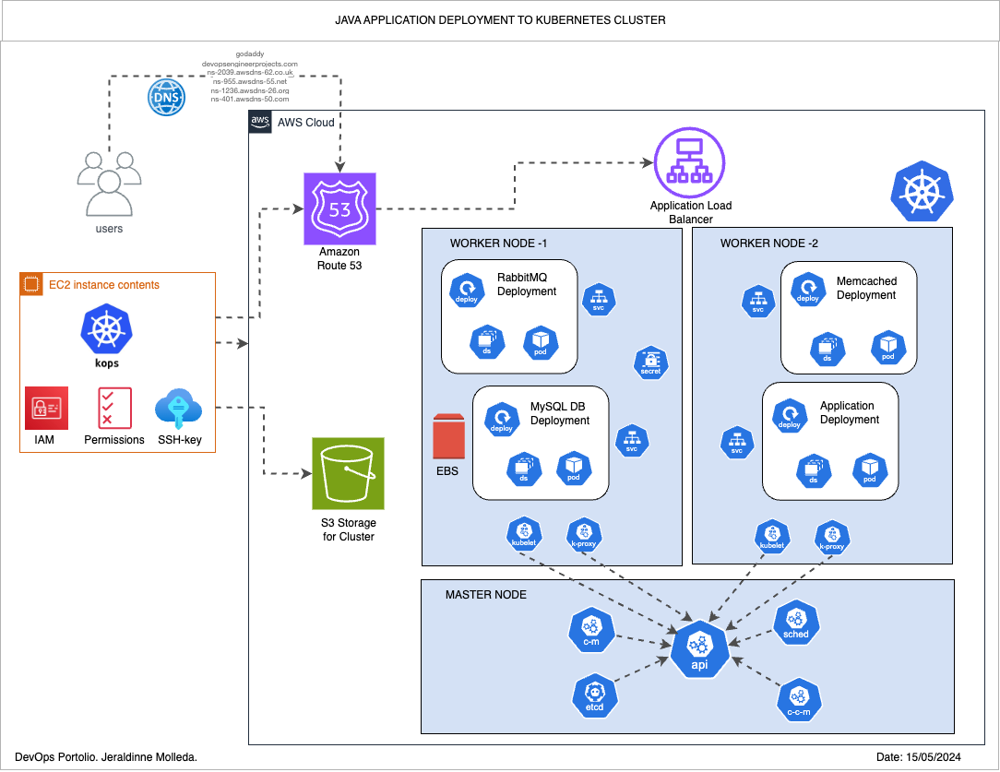
- Kops cluster
  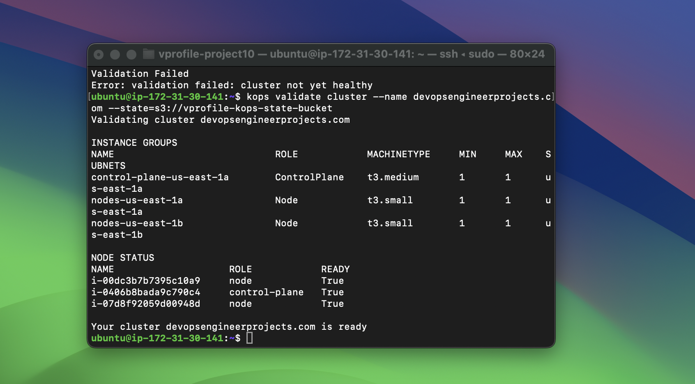
- Kops master-nodes-instances
  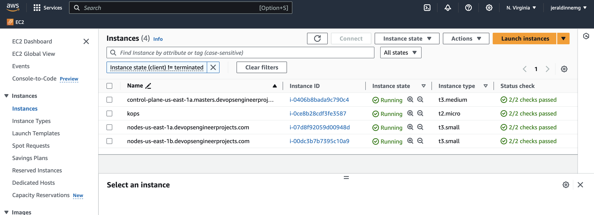
- Autoscaling groups
  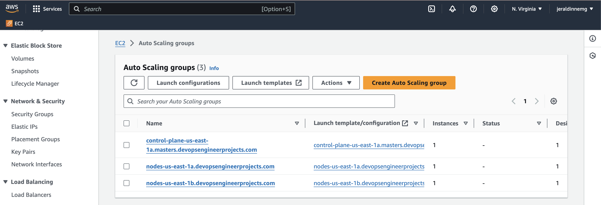
- Kubernetes deployment-services
  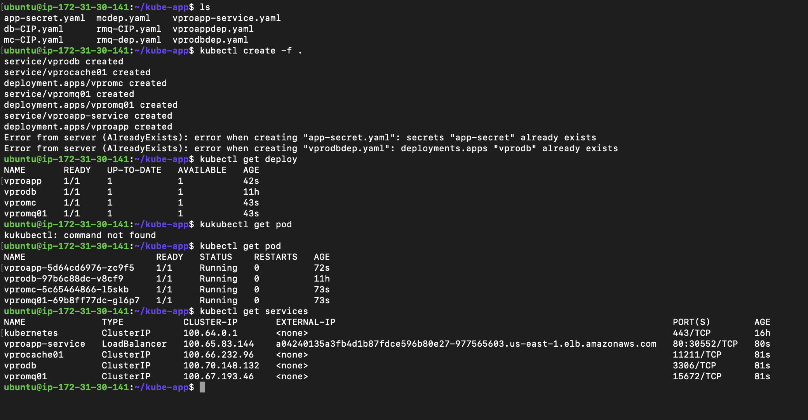
- Load balancer
  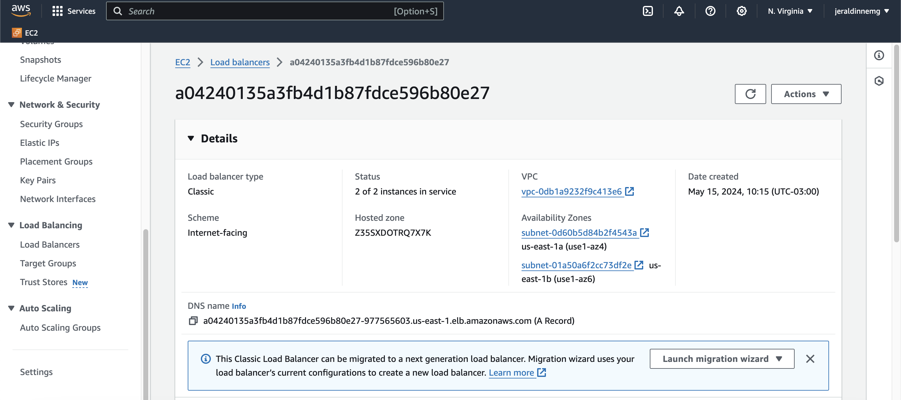
- Route 53 records
  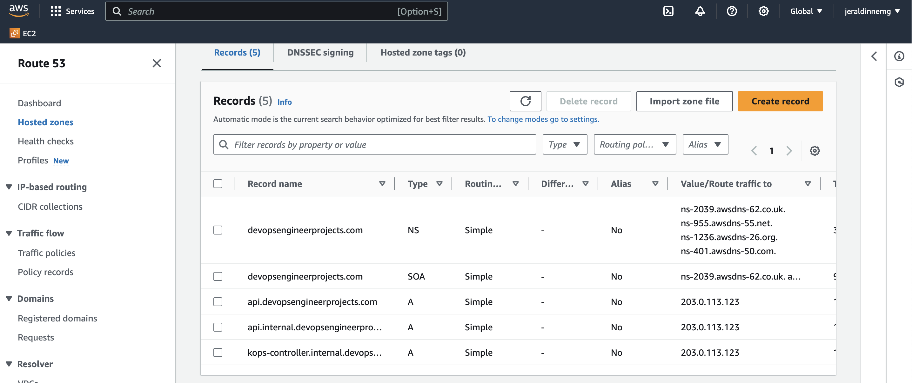
- Vprofile app deploy
  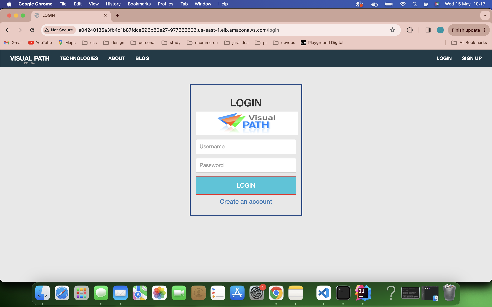
- Vprofile application
  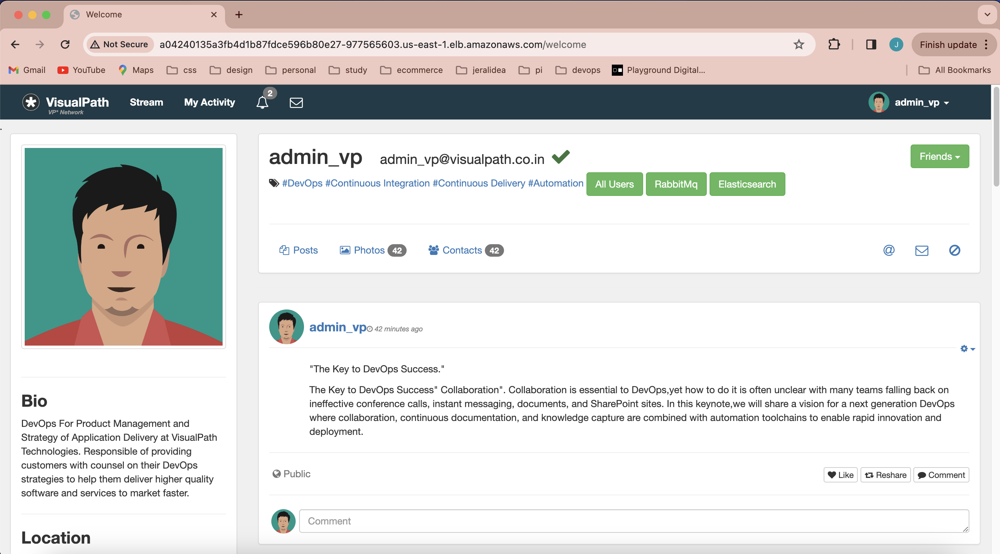
- Vprofile page
  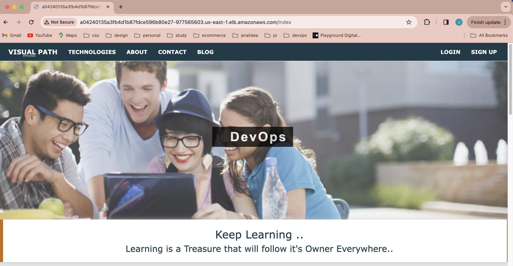
- Rabbit
  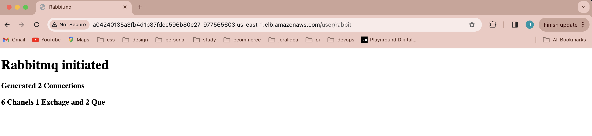
- Users db
  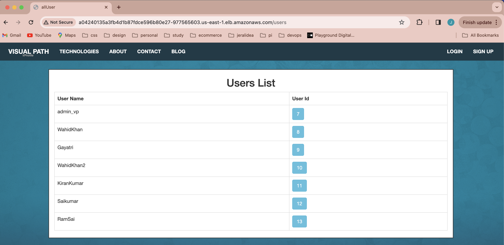
- New dns record (demo-devopsengineerprojects.com)
  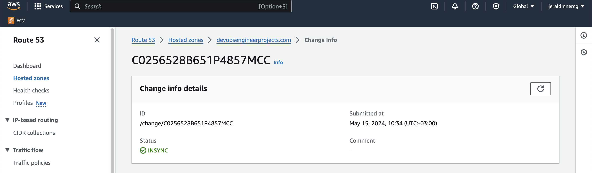
- Demo dns created 
  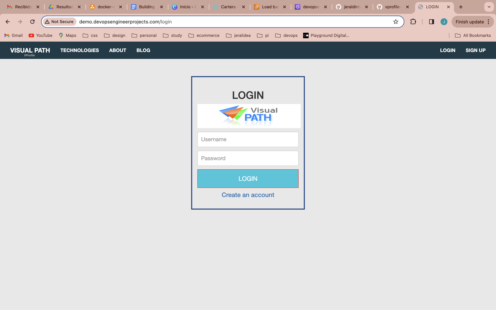
- New user test
  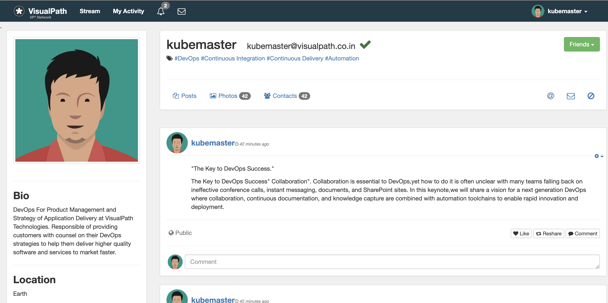